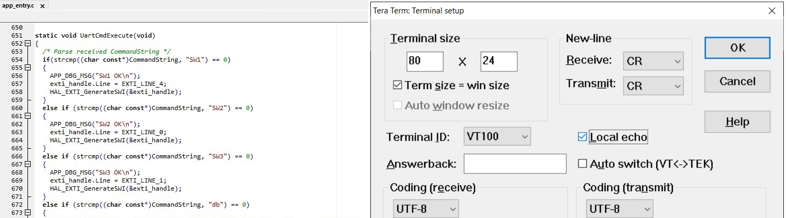
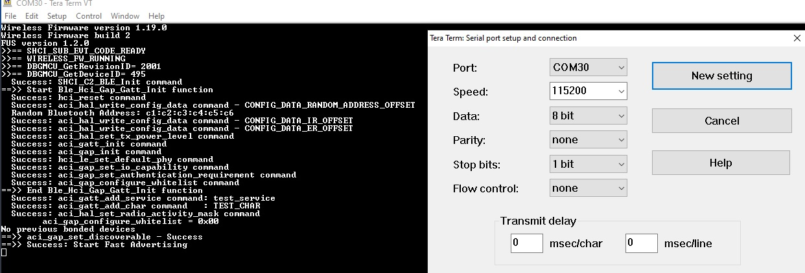
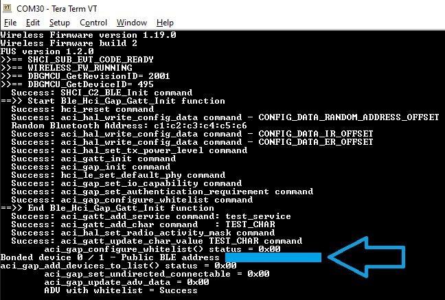
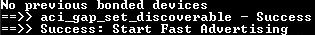
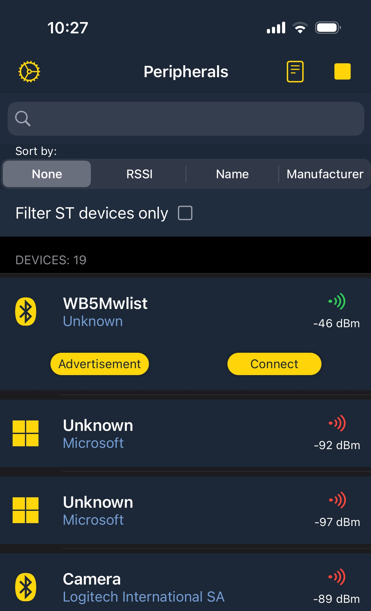
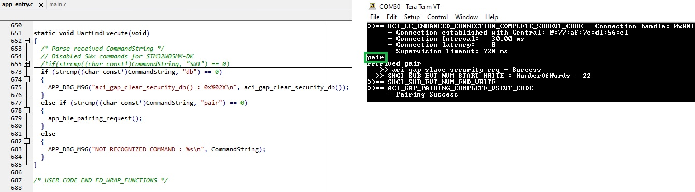
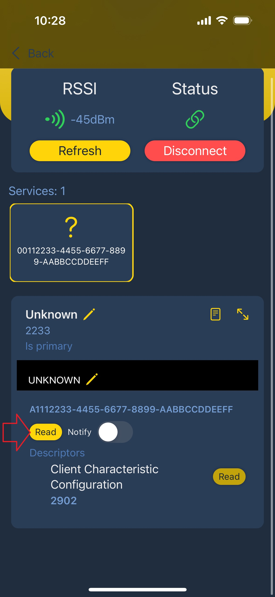
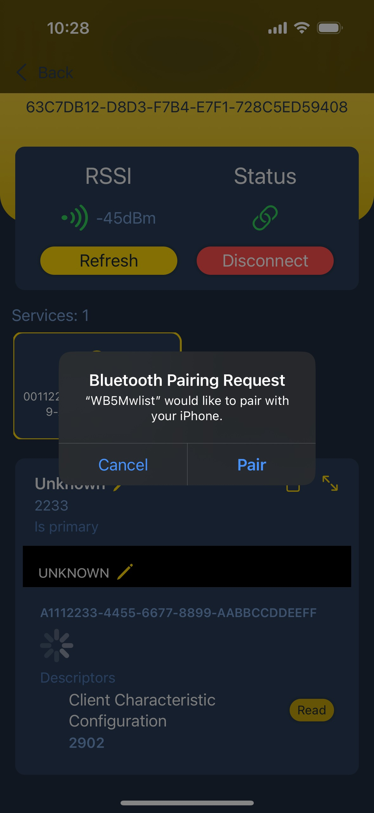
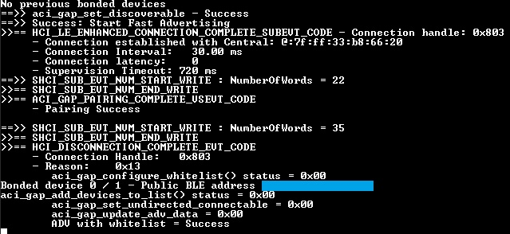
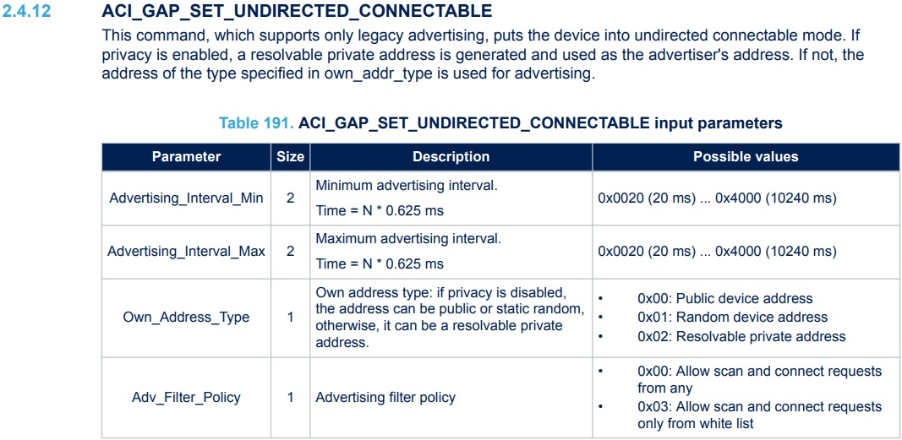

# STM32WB-Filter-Accept-List-Peripheral

* This Bluetooth® peripheral application demonstrates [Bluetooth®'s Filter Accept List (formerly White List)](https://www.bluetooth.com/wp-content/uploads/Files/Specification/HTML/Core-54/out/en/low-energy-controller/link-layer-specification.html#UUID-3649c38e-93fc-347e-e1cc-824b12e59487)

* This example mainly referred to
  * [STM32WB-WBA Filter Accept List](https://wiki.st.com/stm32mcu/wiki/Connectivity:STM32WB-WBA_Filter_Accept_List)
  * [STM32WB and WBA wiki - Bluetooth® LE Privacy](https://wiki.st.com/stm32mcu/wiki/Connectivity:STM32WB-WBA_BLE_Privacy)
  * [PM0271:  Guidelines for Bluetooth® Low Energy stack programming on STM32WB/STM32WBA MCUs - 2.8.1 Device filtering](https://www.st.com/resource/en/programming_manual/pm0271-stm32wb-ble-stack-programming-guidelines-stmicroelectronics.pdf)
  * [AN5270: STM32WB Bluetooth® Low Energy wireless interface](https://www.st.com/resource/en/application_note/an5270-stm32wb-bluetooth-low-energy-ble-wireless-interface-stmicroelectronics.pdf)
  * [Bluetooth Core Specification: Volume 1. Architecture, Mixing, and Conventions- Part A. Architecture](https://www.bluetooth.com/wp-content/uploads/Files/Specification/HTML/Core-54/out/en/architecture,-mixing,-and-conventions/architecture.html#UUID-c0d05013-a336-9950-6d31-174d90150cc0)
  * [Bluetooth Core Specification: Volume 6. Low Energy Controller - Part B. Link Layer Specification](https://www.bluetooth.com/wp-content/uploads/Files/Specification/HTML/Core-54/out/en/low-energy-controller/link-layer-specification.html)

Bluetooth LE supports a feature that reduces the ability to track a LE device over a period of time by changing the Bluetooth Device Address on a frequent basis.

In order for a device using the privacy feature to reconnect to known devices, the device address, referred to as the private address, must be resolvable by the other device.

The private address is generated using the device’s Identity Resolving Key (IRK) exchanged during the bonding procedure.

The term “resolution” means a process used by a device to calculate the device Identity Address from the received private address and the IRK, while the state “resolved” is the successful result of a resolution.

**Device filtering becomes possible when address resolution is performed in the [Controller (hardware)](https://support.bluetooth.com/hc/en-us/articles/360049019812-Core-Layer-Requirements-of-Bluetooth-Designs) because the peer’s device Identity Address can be resolved prior to checking whether it is in the Filter Accept List.**

All Link Layers supporting Link Layer privacy shall contain a set of records for local and peer IRK value pairs.
These values are known as

the Local (STM32WB in this case) IRK

and the Peer (the device connected to STM32WB - ex: smartphone) IRK.

The [Resolving List](https://www.bluetooth.com/wp-content/uploads/Files/Specification/HTML/Core-54/out/en/low-energy-controller/link-layer-specification.html#UUID-2e6f2af2-be5d-bb38-10c7-f1aef716d3fc) IRK pairs shall be associated with a public or static device address known as the Identity Address. The Identity Address may be in the Filter Accept List. All Link Layers supporting Link Layer privacy shall support a Resolving List capable of storing at least one Resolving List Record.

The Filter Accept List and filter policies set by the [Host (network core that runs the Bluetooth LE stack)](https://support.bluetooth.com/hc/en-us/articles/360049019812-Core-Layer-Requirements-of-Bluetooth-Designs) are applied to the associated Identity Address once the Resolvable Private Address has been resolved.

On reset, the Resolving List shall be empty. The Resolving List is configured by the Host and is used by the Link Layer to resolve Resolvable Private Addresses used by advertisers, scanners or initiators.

In this example, if there are no previously bonded devices, the STM32WB will advertise without any filtering policy. Whereas if there are previously bonded devices, the STM32WB adds the previously bonded device's address into the accept list (whitelist) by calling [ACI_GAP_ADD_DEVICES_TO_LIST() explained in AN5270 2.4.42](https://www.st.com/resource/en/application_note/an5270-stm32wb-bluetooth-low-energy-ble-wireless-interface-stmicroelectronics.pdf).

## Hardware Needed

  * One of the following boards
    * [NUCLEO-WB55RG](https://www.st.com/en/evaluation-tools/nucleo-wb55rg.html)
    * [STM32WB5MM-DK](https://www.st.com/en/evaluation-tools/stm32wb5mm-dk.html)
    * [NUCLEO-WB15CC](https://www.st.com/en/evaluation-tools/nucleo-wb15cc.html)

## Software Needed
  * [STM32CubeProgrammer](https://www.st.com/en/development-tools/stm32cubeprog.html) for programming the BLE full stack into the STM32WB series

  * IDE (Optional)

    * [STM32CubeIDE](https://www.st.com/en/development-tools/stm32cubeide.html)

    * [IAR EWARM](https://www.iar.com/products/architectures/arm/iar-embedded-workbench-for-arm/)

    * [Keil MDK-ARM](https://developer.arm.com/Tools%20and%20Software/Keil%20MDK)

  * [Tera Term](https://teratermproject.github.io/index-en.html) (Optional)

  * Bluetooth® LE smartphone apps such as [ST BLE Toolbox](https://play.google.com/store/apps/details?id=com.st.dit.stbletoolbox&hl=en_US)

## User's Guide

* There are 3 examples for each ST boards. Assuming you have [programmed the STM32WB BLE stack](https://www.youtube.com/watch?v=1LvfBC_P6eg&list=PLnMKNibPkDnG9JRe2fbOOpVpWY7E4WbJ-&index=11), program the example with your preferred IDE:

    a) [WB55_whitelist](WB55_whitelist) - STM32WB55 whitelist example for NUCLEO-WB55RG. When advertising, the local name is ***WB55wlist***

    b) [WB5M_whitelist](WB5M_whitelist) - STM32WB5MM whitelist example for STM32WB5MM-DK. When advertising, the local name is ***WB5Mwlist***

    c) [WB15_whitelist](WB15_whitelist) - STM32WB15 whitelist example for NUCLEO-WB15CC. When advertising, the local name is ***WB15wlist***

* In *app_entry.c* the Terminal can receive user's case sensitive keyboard input command. It is useful to enable the *local echo* feature.

  

    a) db: Stop BLE advertising if STM32WB was advertising. Call *ACI_GAP_CLEAR_SECURITY_DB*() to clear STM32WB's bonding table. All bonded devices will be removed. Then restart BLE advertising.

    b) pair: STM32WB requests pairing to the connected smartphone by calling *ACI_GAP_SLAVE_SECURITY_REQ*().

    c) SW1, SW2, SW3 commands might be enabled or disabled since each board have different number of user switches. Check *UartCmdExecute*().

    By default, the switches don't have any functionalities in this example.

* View the debug log output using Tera Term. If you have no previously bonded devices, you will see ***"No previous bonded devices"***

   In that case, the STM32WB starts Bluetooth advertising without any filter policies. COM port number might be different from each STM32WB boards.

  

* Whereas if the STM32WB had a previously bonded device, it will print those devices and start Bluetooth advertising with whitelist.

  

  You can type ***db*** in the terminal to remove all bonded devices and restart the board to advertise without any filtering policies.

* Suppose the STM32WB has never bonded previously, so the STM32WB is advertising without any filtering policies.

  

  Use an Android or iPhone ST BLE Toolbox app to scan and connect. The device name could be ***WB55wlist*** / ***WB5Mwlist*** / ***WB15wlist***

  

* There are two ways to bond after the connection:

    a) Type ***"pair"*** command in the terminal. Then click *Pair* from your smartphone.

    

    b) Select the BLE service and press ***Read*** button. This BLE characteristic has the encryption requirement so the smartphone will start the pairing and bonding process.
    
      

    Click Pair. If you disconnect, the STM32WB has a bonded device, so it adds the bonded device into the whitelist and resolving list.

    As a result, the STM32WB starts advertising with a filtering policy.

    

* For STM32WB advertising with whitelisting, there are only two policies available according to [AN5270 - 2.4.12 ACI_GAP_SET_UNDIRECTED_CONNECTABLE](https://www.st.com/resource/en/application_note/an5270-stm32wb-bluetooth-low-energy-ble-wireless-interface-stmicroelectronics.pdf)

    a) 0x00 *HCI_ADV_FILTER_NO*: Allow scan and connect requests from any

    b) 0x03 *HCI_ADV_FILTER_WHITELIST_SCAN_CONNECT*: Allow scan and connect requests only from whitelist

    

    This example uses the HCI_ADV_FILTER_WHITELIST_SCAN_CONNECT policy, where these filter policies are explained in [4.3.3. Scanning filter policy](https://www.bluetooth.com/wp-content/uploads/Files/Specification/HTML/Core-54/out/en/low-energy-controller/link-layer-specification.html#UUID-67156252-3516-a061-7099-25ea0c5beff4)

* During STM32WB's advertising with whitelisting, a different smartphone that wasn't added to the accept list (whitelist) cannot create a *CONNECTION REQUEST*.

## Troubleshooting

**Caution** : Issues and the pull-requests are **not supported** to submit problems or suggestions related to the software delivered in this repository. The STM32WB-Whitelist example is being delivered as-is, and not necessarily supported by ST.

**When testing with multiple STM32WB boards** : If every STM32WB use the identical Identity Root (IR, see *CFG_BLE_IR* value *app_conf.h* file) key value, which is used to generate IRK, it's not possible to distinguish two devices which advertise using Resolvable Private Addresses (RPA). Each STM32WB should have a different IR value. Once the IR value is set, don't change the IR value so that the smartphone can resolve STM32WB's RPA.

**For any other question** related to the product, the hardware performance or characteristics, the tools, the environment, you can submit it to the **ST Community** on the STM32 MCUs related [page](https://community.st.com/s/topic/0TO0X000000BSqSWAW/stm32-mcus).